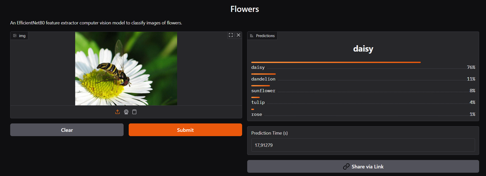

Demo: 👉 [Try it on Hugging Face Spaces](https://huggingface.co/spaces/dogukang/Flowers)

 Flowers - Image Classification with EffNet_B0

## 📦 Teknologies
- 🔍 Model: EfficientNet_B0 (`torchvision`)
- 📚 Dataset: Brain XRAY (5 class (DAISY - DANDELION - ROSE - SUNFLOWERS - TULIP)) [Dataset](https://www.kaggle.com/datasets/alxmamaev/flowers-recognition)
- 🧠 Training: PyTorch, torchvision
- 🖼️ UI: Gradio
- 📁 Weights: Stored in `.pth`, auto-loaded on inference

## 🚀 Train Summary
- Epochs: 5
- Loss Function: `nn.CrossEntropyLoss()`
- Optimizer: `Adam`

📌 Notes:
The model was loaded using torchvision.models.efficientnet_b0(weights=...).

Results:
- EffNet_B0 : Epoch: 5 | train_loss: 0.4336 | train_acc: 84.5299 | test_loss: 0.2963 | test_acc: 89.7693

